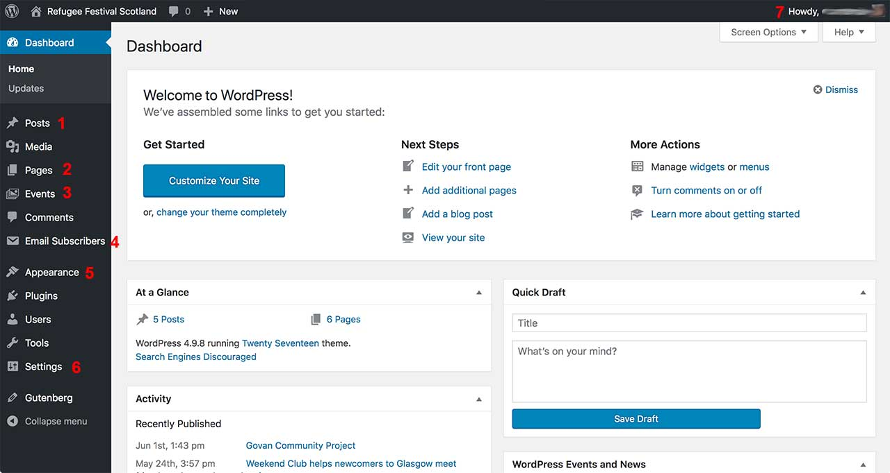

# Refugee Festival Scotland website

1. [General Information](#general-information).
2. [Dashboard](#dashboard).
3. [How to create a new event](create-a-new-event.md).
4. [How to edit an existing event](edit-existing-event.md).
5. [How to create a new programme page](create-new-programme-page.md).
6. [How to move last year's festival programme page to the submenu](archive-a-programme-page.md).
7. [View or edit the Subscribers list](subscribers-list.md).
8. [Maintenance](maintenance.md).

## General information

The WordPress Content Management System has been used to build the Refugee Festival Scotland website. It includes some custom functionality to create and manage current and previous Festival pages and  events.

This functionality can be seen in the pages with a title including the text  “What's On”.
So “What's On” would be the current year's festival programme page and “What's On 2017” would be the 2017 Festival Programme page.

To add or edit content to the website, you will need to login to the Dashboard.

To access the login page, go to <https://refugeefestivalscotland.co.uk/wp-login.php>

## Dashboard

After login, you will see a screen similar to that shown in Illustration 1.

The main sections have been highlighted by a red number and are as follows:

	1. Posts – posts are listed in reverse chronological order on the Stories section.
	2. Pages – the Festival programme pages all have the name “Programme YYYY” where YYYY indicates the full year. For further information, please refer to section 5: How to create a new Programme page
	3. Events – the festival events, both for the current and the previous year's festivals. For further information, please refer to sections 3 and 4 (how to create a new or edit an existing Event)
	4. Email Subscribers – details of all people who have signed up to the mailing list via the form in the website footer.
	5. Appearance > Widgets > Footer widgets -
	6. Settings > Privacy -
	7. User Profile and Logout -

## How to create a new event

## How to edit an existing event

## How to create a new programme page

## How to move last year's festival programme page to the submenu

## View or edit the Subscribers list

## Maintenance
