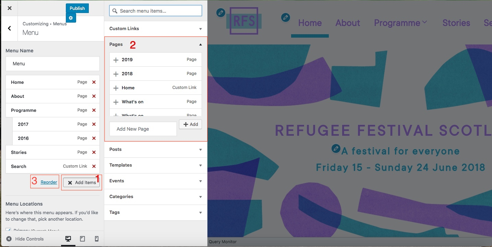
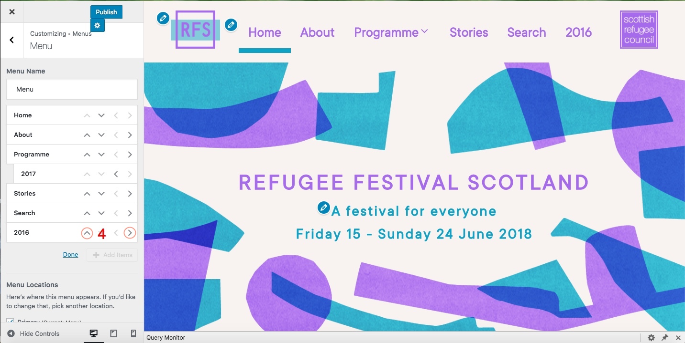
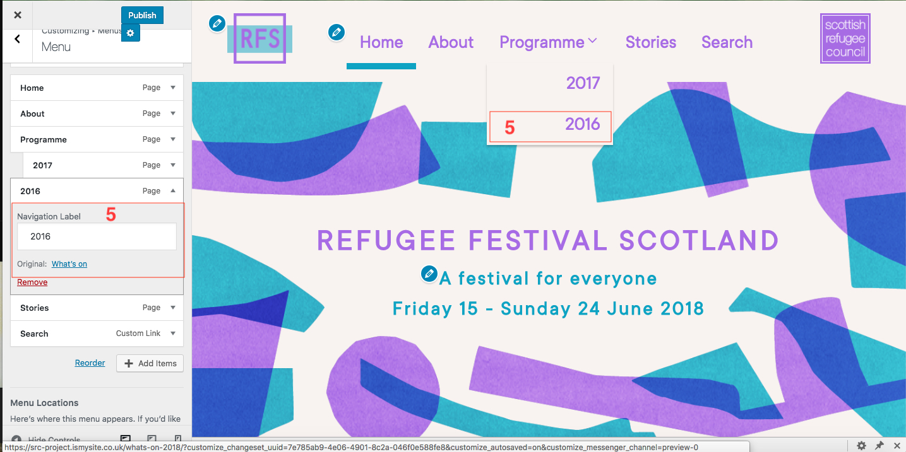
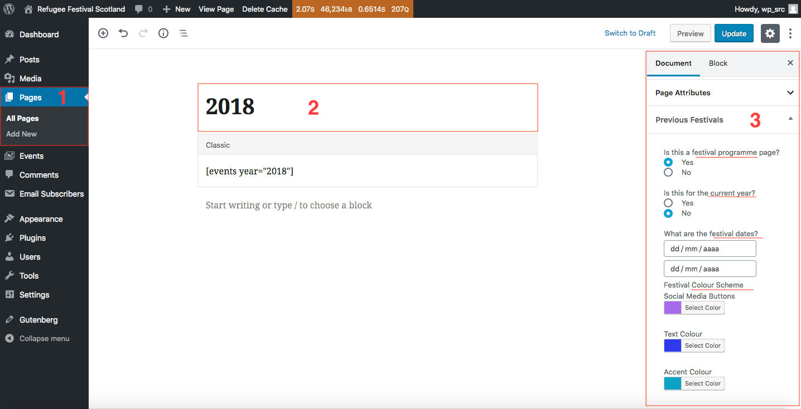

# How to move a festival programme page to the submenu

Here are the steps to move a festival programme page into the submenu:

1. Login to the **Dashboard**.

2. Click on **Appeareance** > **Costumize** > **Menu** from the left-hand side menu.

*Illustration 1: Customizer - Menu tab.*

*Illustration 2: Customizer - Menu - Reorder tab.*

*Illustration 3: Customizer - Menu - Navigation Label tab.*

*Illustration 3: Dashboard - Pages - Edit Page tab.*

The festival programmes are part of the menu bar. When you hover, it'll display a list of previous years where the programmes can be accessed. The programme for the current year will be accessed by clicking on programme directly.

Previous programme can be added from the menu tab on the customiser sidebar by selecting add items and then clicking on the page that would be added. They are shown in *Illustration 1* as a red **1** and **2**.

Once you have selected the page to be added, click on reorder and use the arrows to move it to the correct place. Click on done once you're finishe. They are shown in *Illustration 1* as a red **3** and *Illustration 2* as red **4**.

To change the text that will appear on the menu, i.e. from *Programme* to *2018*. Click on the item and change the navigation label. This is shown in *Illustration 3* as a red **5**.

Remember to click the **Publish** button, at the top of the screen, to save the changes.

Once this has been done, go to the *Correspondent Programme* page, i.e 2018, and make the following changes as shown in *Illustration 4* as a red **1**, **2** and **3**.

* Go to Pages and select the one that you'll modify
* Make sure the name is correct, i.e. 2018
* On the *Document* tab, under *Previous Festivals* select the correct answer. Select *Yes* to Programme Page, *No* to the Current Festival and finally, select the appropiate dates and colour scheme (if applicable) 