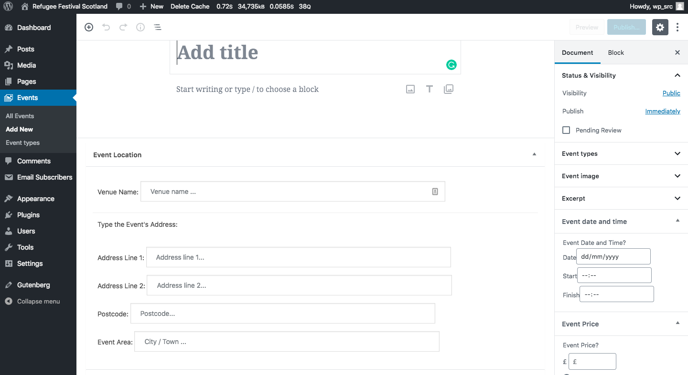

# How to create a new event

Here are the steps to create a new event:

1. Login to the **Dashboard**.

2. Click on **Events** > **Add New** from the left-hand side menu.

3. The New Page editor screen will look like this:

_Illustration 1: the New Event editor screen_

4. you will get the form to enter the information about the event organizer,
   the date and the price on the second page

_Illustration 2: the New Event editor screen_

5. In order to insert about the Event location and the event Organizer, you will find the place on the bottom of the page

_Illustration 3: the New Event editor screen_

6. To insert about the Event types, Event image, Event date and time and the Event Price you will get on the right hand-side of the page

7. make sure that you eneter the right value in the field.

8. Once this is done, you just need to click the **Publish** button to finish.
   If you would prefer to preview the changes before published the event, you can do so by clicking the **Priview** button instead.

[<< Back to main documentation page.](README.MD)
