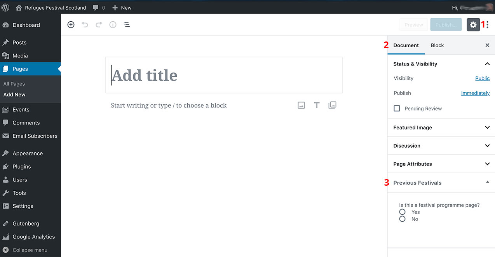
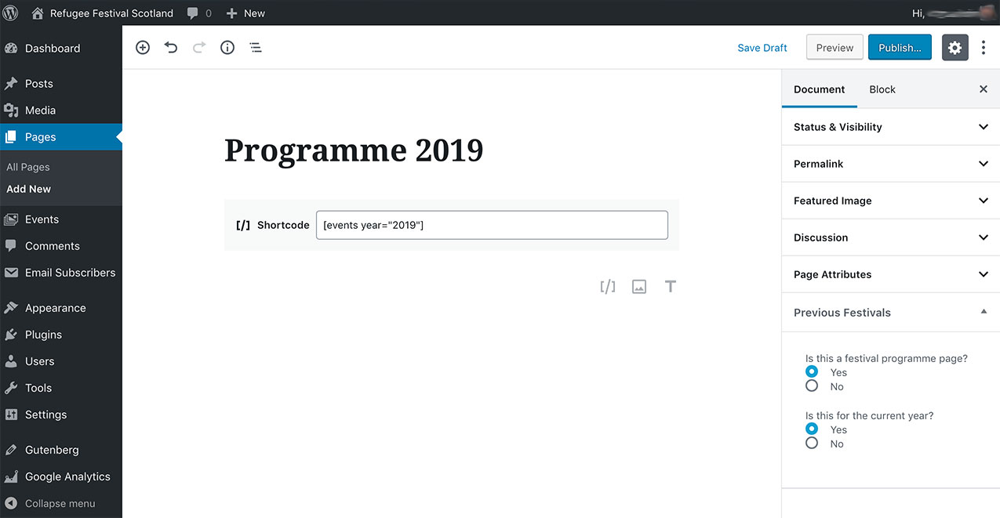

# How to create a new programme page

Here are the steps to create a new festival programme page:

1. Login to the **Dashboard**.

2. Click on **Pages** > **Add New** from the left-hand side menu.

3. The New Page editor screen will look like this:

*Illustration 1: the New Page editor screen*

4. The **page title** must be **Programme YYYY**, where YYYY is the Festival year. For example, *Programme 2019*.
This is important as the styling of the website relies on a standard naming convention for the programme pages.

5. In order to display the **events list** in the new programme page, we need to add the corresponding **shortcode** to the page content area. For example, to display the 2019 festival events, we would add the shortcode `[events year="2019"]`.

6. From the **right-hand sidebar**, choose *"Yes"* as a reply to the question *"Is this a festival programme page?"*.
If you can't see the right-hand sidebar, click first the **Settings button** on the top-right corner of the screen (shown as a red **1** in *Illustration 1*) and then the **Document** tab (shown as **2**).

7. Then, as a reply to the question *"Is this for the current year?"*, choose *"Yes"* if it's for the forthcoming festival or *"No"* if it isn't.

You will end up with something like this:

*Illustration 2: a complete new Programme page.*

If the page isn't for a forthcoming festival, you will be asked to enter the corresponding past festival dates in a new box. Please refer to [How to move a festival programme page to the submenu](archive-a-programme-page.md) for further details.

8. Once this is done, you just need to click the **Publish** button to finish.
If you would prefer to save the changes but not publish the page yet, you can do so by clicking the **Save Draft** link instead.

[<< Back to main documentation page.](README.MD)
