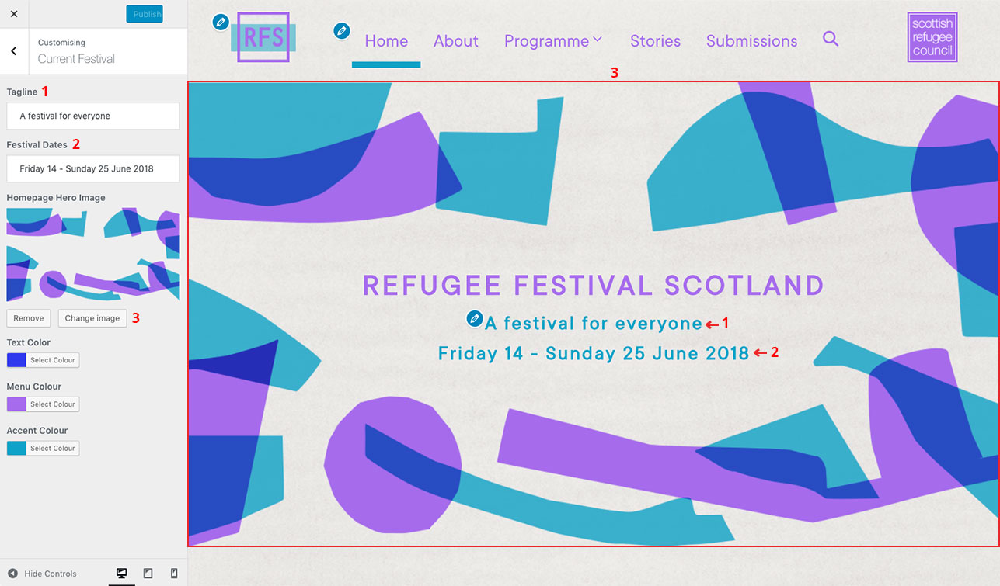
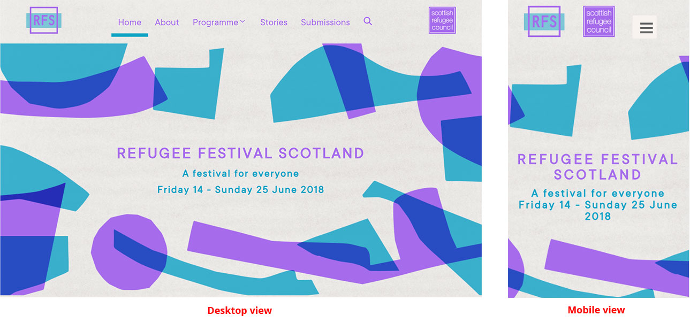

# How to customise the website to match the current festival design

The Customizer allows us to change the website's colour scheme and homepage hero image to match those of the upcoming festival.

To do so, you will need to login to the Dashboard and, from the left-hand side menu, click on **Appearance > Customizer** and choose **Current Festival** from the new screen.

The following sidebar will show:

*Illustration 1: Customizer - Current Festival tab.*

## Edit the festival dates and tagline

The festival dates and tagline are shown in the homepage, in the centre of the hero image.

They can be edited from the corresponding fields on the customiser sidebar. They are shown in *Illustration 1* as a red **1** and **2**.

These two fields will always be shown in the centre of the hero image.

Remember to click the **Publish** button, at the top of the screen, to save the changes.

## Change the hero image

The hero image is also shown in the website homepage and takes up most of the space when the site is initially loaded.

It can be changed, from the Customizer's Current Festival tab, by clicking the **Change Image** button, shown as a red **3** in *Illustration 1*.

The recommended hero image minimum width and height is 1200 pixels by 600 pixels.

It is recommended that the hero image has enough empty space in the middle to make it easy for viewers to read the festival dates and tagline.

Please be aware that the hero image will always keep its proportions and show centered, both vertically and horizontally. Because of this, how much of it is displayed will depend on the width of the screen the viewer uses to access the website. See the image below for an illustration of this:

*Illustration 2: Hero image comparison from a desktop and a mobile device.*

Remember to click the **Publish** button, at the top of the screen, to save the changes.

## Change the colour scheme

The 3 main colours used in the website can also be changed to match the current festival colour scheme.

This can be done form the Customizer's Current Festival tab.

> Please note that you will need to have the new colours **HEX code** in order to do this. If you are not sure what the colours' codes are, please request them from the graphic designer.

Please note that, when choosing colours, it is important that the contrast between the background colour and the text colour is still enough to allow for the content to be read with ease. If you have doubts about this, we recommend to double check with an online tool such as the [Colour Contrast Ratio Analyser](http://juicystudio.com/services/luminositycontrastratio.php).

The 3 main colours have been named **Text Color**, **Menu Color** and **Accent Color**.

### Text Color

The Text Color is applied to all body and footer text as well as the following:

* all page and blog titles, except for the homepage,
* the programme page filter fields background,
* some of the text (such as event type, ticket price and organiser names) in the single event page, and
* the "Subscribe to Newsletter" widget title, at the bottom of all pages.

### Menu Color

The Menu Color is applied to all navigation menu items, as well as the following:

* all buttons,
* the homepage site title,
* the single event's main body text,
* the event's social media links,
* the "Subscribe to Newsletter" tagline, at the bottom of all pages.

### Accent Color

The Accent Color is used to:

* underline the current page name in the navigation menu,
* underline each event title in the programme page,
* also in the programme page, to separate the filter from the events list,
* for the Refugee Festival Scotland social media links at the bottom of each page,
* as the background colour of the "Subscribe to Newsletter" name and email fields, and
* in the single event page, to display the event's address.

Remember to click the **Publish** button, at the top of the screen, to save the changes.

> These changes will apply to the whole website except the previous year's programme pages, if they have been given their own colour scheme. Please refer to [How to move a programme page to the submenu](archive-a-programme-page.md) for further information.

[<< Back to main documentation page.](README.MD)
