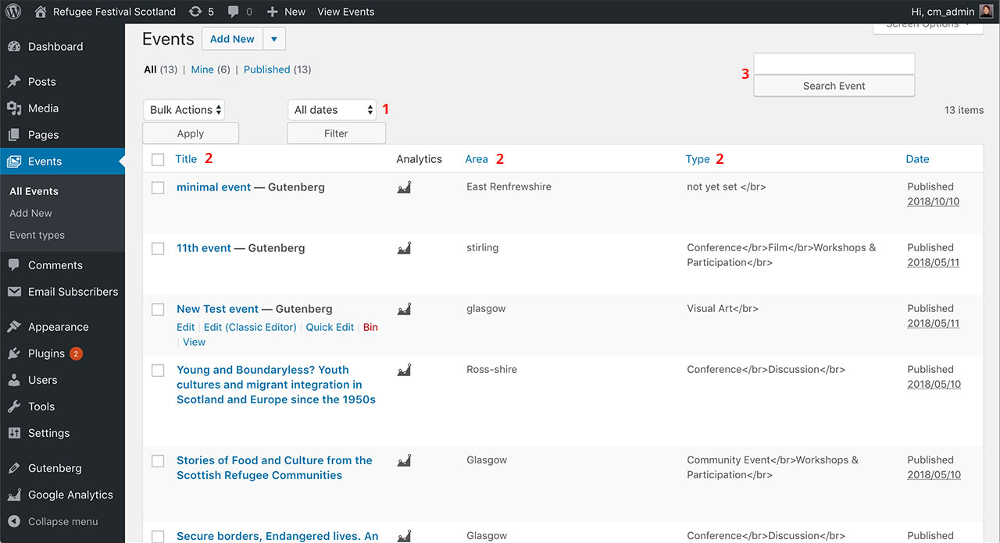

# How to edit an existing event

All Authors can edit or delete the events they have entered themselves.

Editors can also edit or delete the events created by other Authors.

To Edit an existing event,

1. Go to the Dashboard > **Events** > **All Events** page,

2. Find the event you wish to edit. If you can't see it on the first page, you can filter them by date (see **1** on the illustration below), order them (A-Z or Z-A) by event title, area or type (see **2** below) or search by title (see **3**)

3. Once you've found it, click on it to open the Edit screen, make your changes and update the event.

*Illustration 1: All Events table.*

If you the only change you wish to make the **event title** or **event type**, you can do so form the All Events table by:

1. hovering the mouse over the event title,

2. click **Quick Edit** from the little menu that appears below the event title,

3. change the event title or type and click the **Update** button.
