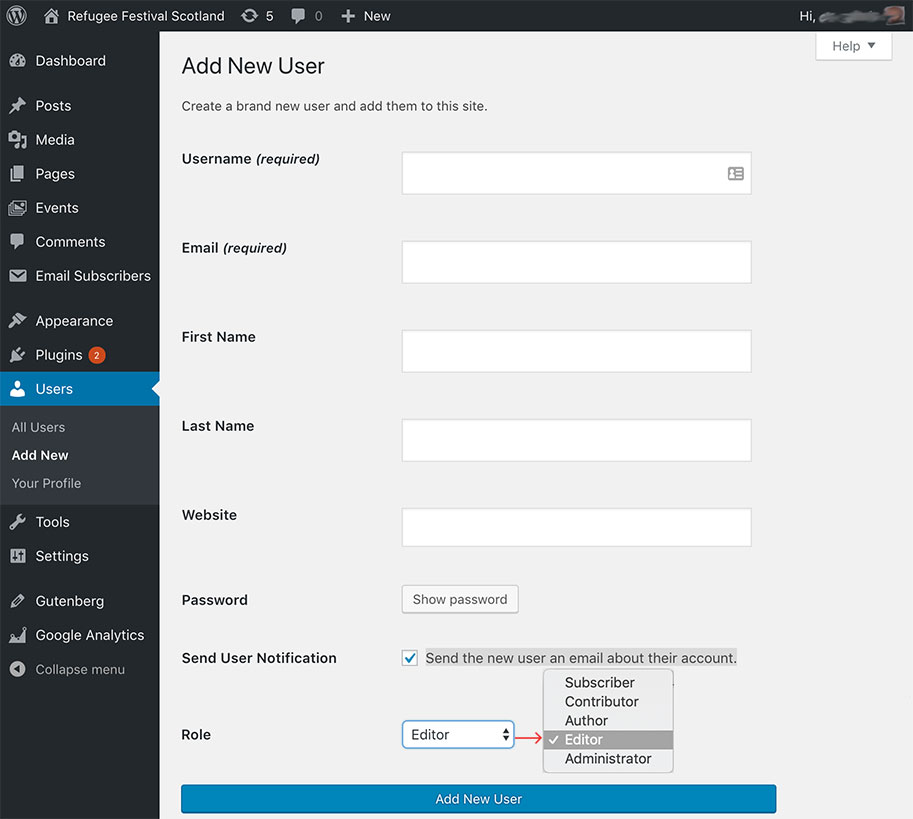
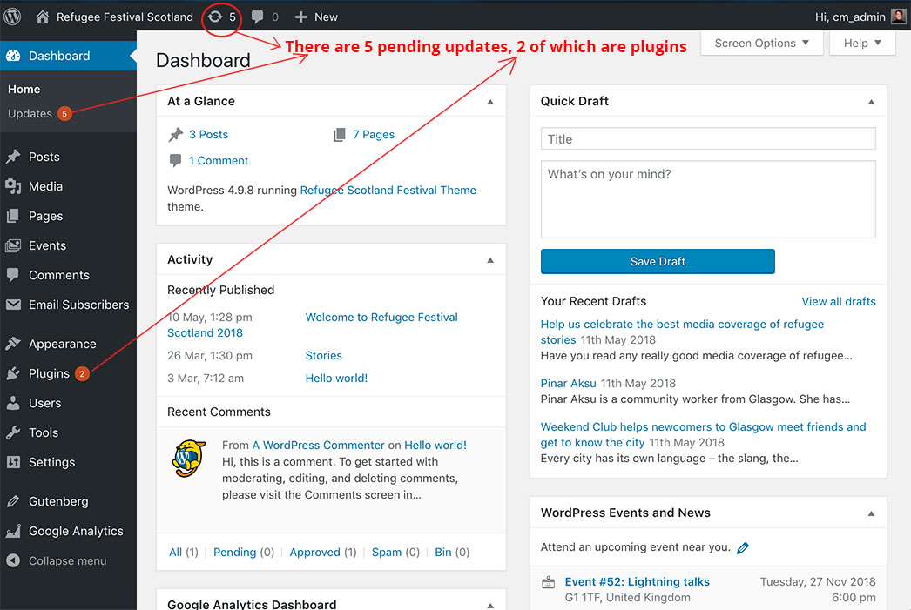

# Maintenance

Here are several tasks we can do to keep the website tidy and in good working order.

## How to create new or edit existing users

We will need to create a new user if there is a new person that needs access to the website dashboard, for example to enter events for the forthcoming  Festival Programme.

To do so, we must login as Administrator and, once in the Dashboard, click on the **Users** > **Add New menu** option.

We will need to have the person's **email address** and choose their **username**. We can also choose their initial password, or let the system set an automatic secure one.

> It is recommended that we let the system "Send the new user an email about their account" by clicking the corresponding option.

If the new user needs to be able to create new events and edit or delete their own events only, we will give the role of **Author**.

If the new user needs to not only be able to create and edit or delete their own events but also those events created by other people, we will give them the role of **Editor**.

See the image below for an example:

*Illustration 1: New User screen.*

Remember to click on the **Add New User** button before exiting the screen.

To edit an existing user, to change their password for example, we would click on the **Dashboard** > **All Users** menu first and then click on the username that we want to Edit from the list.

A similar screen to the shown in *Illustration 1* will open. All user details can be changed except the username.

This task can only be done by a user with Administrator rights.

## How to delete a user

It is important to delete the user logins that are no longer needed, as this ensures that only those who are meant to, have access to the dashboard.

This can be done, from the Dashboard > Users screen, by hovering the mouseover the username to remove and click on **Delete** from the little menu that appears underneath.

If more than one username is to be deleted, you can do so by first selecting them from the list, then choosing **Delete** on the **Bulk Actions** dropdown menu above the table and, finally clicking the **Apply** button.

## Backups

An automatic backup of the website and its database is run every day at 2:00am. The backup files are stored in Google Drive.

The most important point regarding the backups is to keep an eye on them to make sure they do run smoothly.

To do this, you will need to be logged in as the Administrator and go to **Dashboard** > **BackWPup Pro** > **Jobs**. This screen will tell you wen was the last backup run, how long it took and give you a link the log.

If the automatic backup encounters a problem, a notification is sent to festival@refugeefestivalscotland.co.uk with some information as to what went wrong.

Doing regular website backups is important because if the website ever got damaged for any reason, we would be able to minimise the disruption by it re-installing it from the last healthy backup.

## How to install the WordPress core, Plugin and Theme updates

Every now and then there will be a software update for either WordPress, the website Theme or any of the plugins used by the site.

It is good to run the updates as soon as we realise there are any to be installed. Most of the times a WordPress site has got hacked has been due to an out-of-date plugin!

You can see if there are any pending updates from the Dashboard's top navigation bar or as an orange circle next to the Plugins menu option. See it on *Illustration 2* below:

*Illustration 2: WordPress, plugin and theme updates*

> Please make sure you have a **recent website backup**  before updating WordPress core or any plugin or theme. It happens rarely, but sometimes two plugins may clash with each other or with the theme after updating them.

To install the updates, click on the **Dashboard** > **Updates** menu option, select the items you wish to update from the list and click the **Update** button.

[<< Back to main documentation page.](README.MD)
