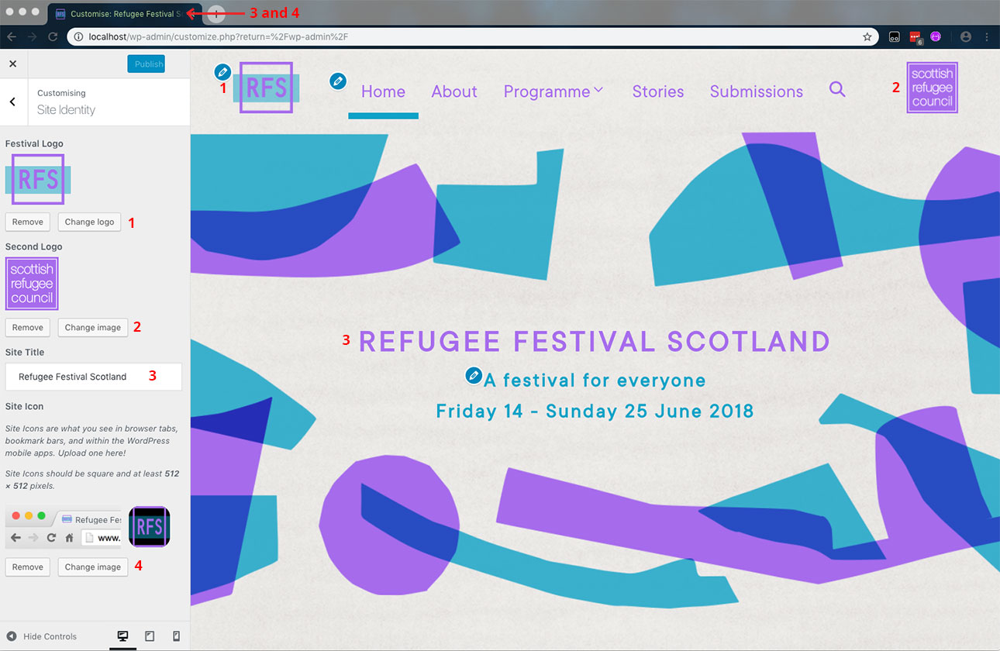

# Other Website Customisations

We can also change the two logos shown on either side of the top navigation bar and the background image for the whole website.

To do so, we will need to login to the Dashboard and, from the left-hand side menu, click on **Appearance** > **Customize**, and choose **Site Identity** from the new screen.

The following sidebar will show:

*Illustration1: Customizer - Site Identity tab.*

## Change the logos

Both the Refugee Festival Scotland and the Scottish Refugee Council logo images can be updated by clicking the corresponding **Change Image** button, marked with a red **1** and **2** in *Illustration 1* above.

When displayed, the height of both logos will be limited to 80 pixels to match that of the navigation bar. The logos' width will adapt accordingly, so that its proportions are kept intact.

The **site icon** is the tiny icon shown in the internet browser's most outer tab. It is shown in *Illustration 1* as a red **4**, and can also be changed from this screen.

Remember to click the **Submit** button at the top of the screen in order to save the changes.

## Change the background image

The background image used for the whole website can also be changed from the **Background Image** Customizer tab.

This image will stretch to cover the whole screen and will be used in every website page. Because of this, it is recommended to use a small image that will be quick to load and will not look distorted when its proportions are changed.

Please make sure as well that its colours, combined with those used for the text, will not make it difficult for the viewer to read the website content. If in doubt, please refer to the [Colour Contrast Ratio Analyser](http://juicystudio.com/services/luminositycontrastratio.php).

Remember to click the **Submit** button at the top of the screen in order to save the changes.

[<< Back to main documentation page.](README.MD)
