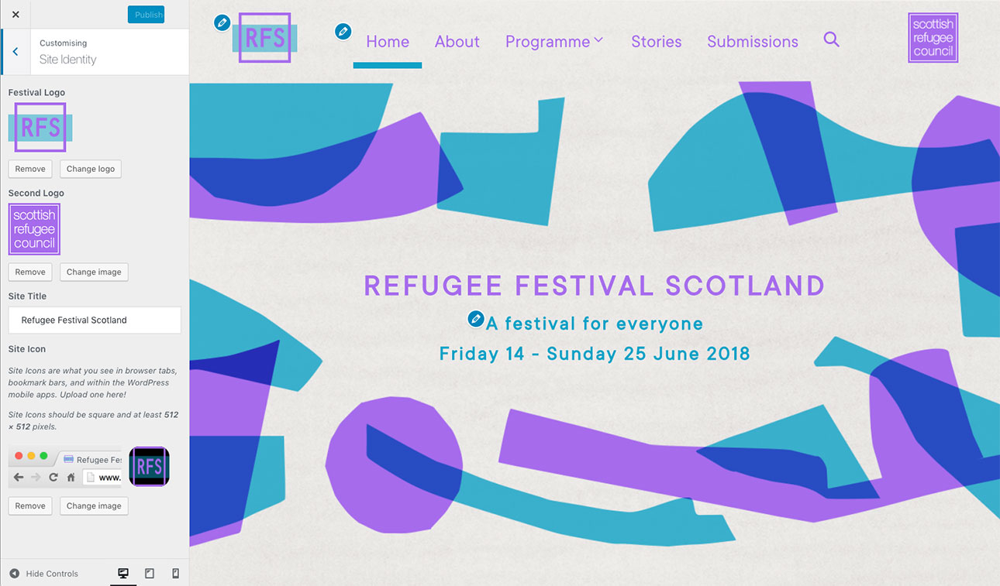

# Other Website Customisations

We can also change the two logos shown on either side of the top navigation bar and the background image for the whole website.

To do so, we will need to login to the Dashboard and, from the left-hand side menu, click on **Appearance** > **Customize**, and choose **Site Identity** from the new screen.

The following sidebar will show:

*Illustration1: Customizer - Site Identity tab.*

## Change the logos

## Change the background image

[<< Back to main documentation page.](README.MD)
