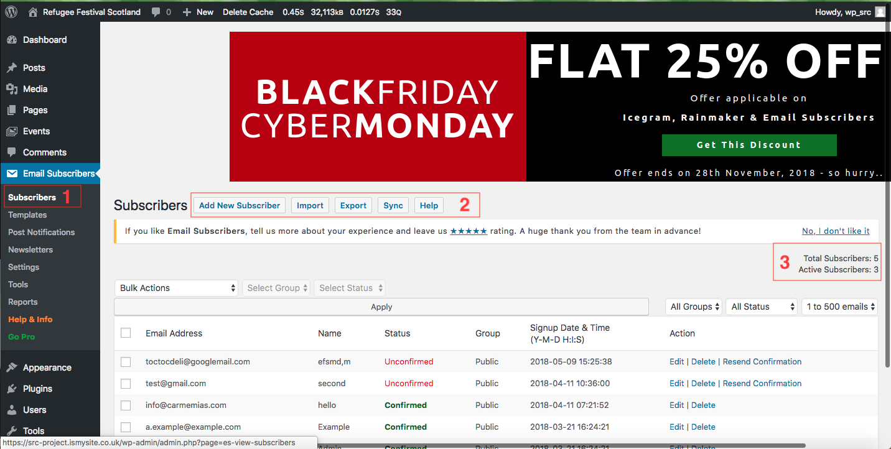
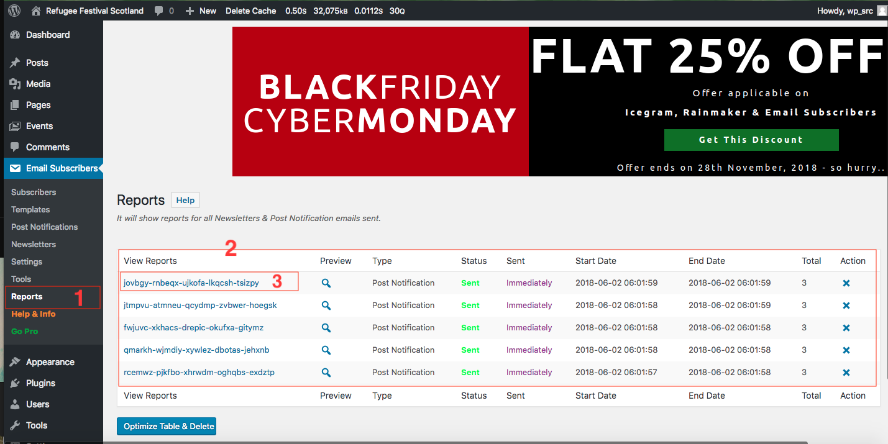
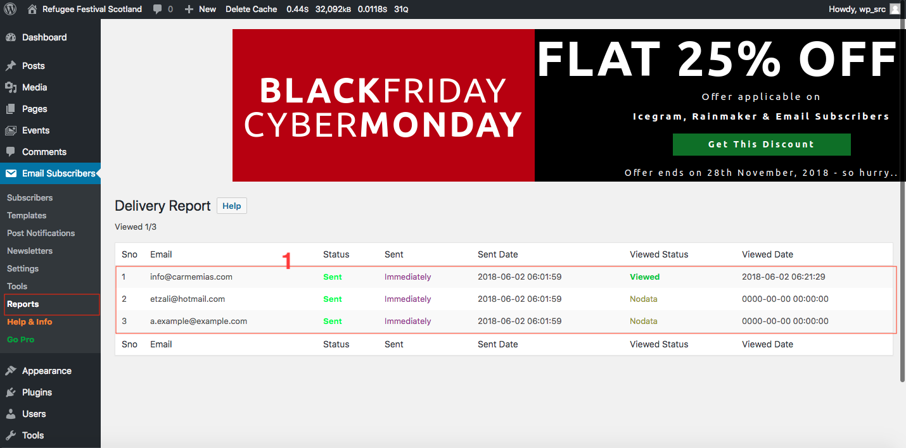

# How to view or edit the Subscribers list

Here are the steps to view/edit the Subscribers list:

1. Login to the **Dashboard**.

2. Click on **Email Subscribers** from the left-hand side menu.

*Illustration 1: Email Subscribers - Subscribers tab.*

*Illustration 2: Email Subscribers - Reports tab.*

*Illustration 3: Email Subscribers - Reports - Delivery Report tab tab.*

If you click on **Subscribers** you can see a list of the people who have registered for the newsletter. On the top you can see a set of actions to add, import and export the list of subscribers. On the right-hand side you can see the *Total Subscribers* and the *Active Subscribers*. They are shown in *Illustration 1* as a red **1**, **2** and **3**.

If you click on **Reports** you can see a list of reports for each *Newsletters* and *Post Notification* that has been done, including the date and the total number of senders. They are shown in *Illustration 2* as a red **1**, **2** and **3**.

When you click on one of the reports (*Illustration 2* as a red **3**), it'll show a develivery report that incudes the email fo the recepient, sent date, viewed status and viewed date. They are shown in *Illustration 3* as a red **1**.
